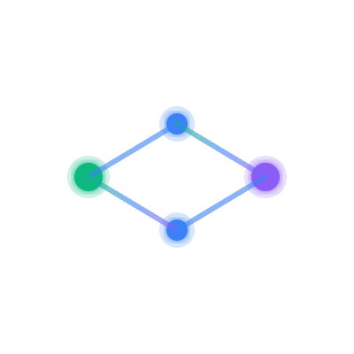
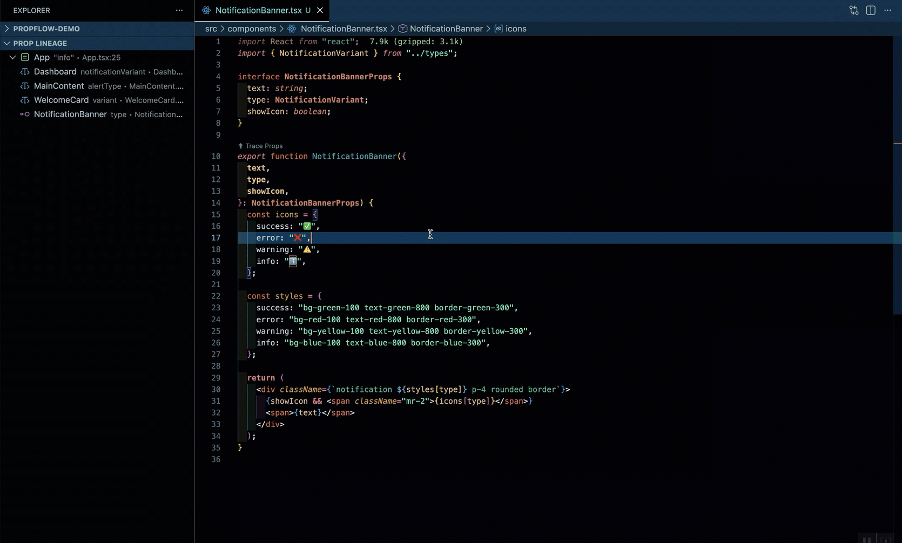
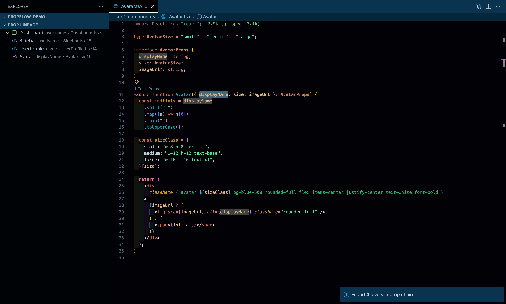

# PropFlow

<div align="center">



**Visualize React prop flow and eliminate prop drilling confusion**

[](https://marketplace.visualstudio.com/items?itemName=propflow.propflow)
[](https://marketplace.visualstudio.com/items?itemName=propflow.propflow)
[](https://marketplace.visualstudio.com/items?itemName=propflow.propflow)
[](https://opensource.org/licenses/MIT)

[Features](#-features) • [Installation](#-installation) • [Usage](#-usage) • [Demo](#-demo) • [Contributing](#-contributing)

</div>

---

## 🎯 Problem Statement

In large React applications, tracing where props originate becomes a time-consuming manual process:

1. You see a prop being used: `<Button variant={variant} />`
2. You navigate to the parent to find where `variant` comes from
3. The parent passes `variant={type}` - it's renamed!
4. You navigate to the grandparent
5. Repeat 5-10 times until you find the source

**PropFlow solves this** by showing you the complete propflow lineage instantly, right where you need it.

---

## ✨ Features

### 🔍 **Instant Hover Tracing**

Hover over any prop to see the complete data flow from source to destination.



### 🌲 **PropFlow Lineage Tree**

Visual hierarchical sidebar showing the full component chain.



### 🎨 **Color-Coded Visualization**

- 🟢 **SOURCE** - Where data originates (literal values)
- 🔵 **USAGE** - Pass-through components
- 🟣 **DEFINITION** - Current component

### 🚀 **Click-to-Navigate**

Jump directly to any component in the chain with one click.

### ⚡ **Performance Optimized**

- Sub-second tracing for 5+ level deep chains
- Pull-based analysis (on-demand only)
- Efficient AST parsing with ts-morph
- Leverages VS Code's native language server

### 🛠️ **Handles Edge Cases**

- ✅ Prop renaming: `<Child name={props.title} />`
- ✅ Prop spreading: `<Child {...props} />`
- ✅ Destructured props: `function Comp({ a, b })`
- ✅ Default & named exports
- ✅ Import aliases

---

## 📦 Installation

### From VS Code Marketplace

1. Open VS Code
2. Press `Ctrl+Shift+X` (or `Cmd+Shift+X` on Mac)
3. Search for "PropFlow"
4. Click Install

### From VSIX File

1. Download the latest `.vsix` file from [Releases](https://github.com/yourusername/propflow/releases)
2. Open VS Code
3. Press `Ctrl+Shift+P` → Type "Install from VSIX"
4. Select the downloaded file

### From Source

```bash
git clone https://github.com/rutpshah/propflow.git
cd propflow
npm install
npm run compile
npm run package
code --install-extension propflow-<version>.vsix
```

---

## 🚀 Usage

### Method 1: Hover (Recommended)

1. Open any React component file (`.tsx`, `.jsx`)
2. Hover over a prop in the component parameters
3. See the complete flow instantly

**Example:**

```tsx
function Button({ label }) {
  // ← Hover over "label"
  return <button>{label}</button>;
}
```

**Result:**

```
🟢 App (SOURCE)
    └─ prop: "Click Me"
        ↓
    🔵 Card
        └─ prop: "buttonText" → "label"
            ↓
    🟣 Button
        └─ prop: "label"
```

### Method 2: Command Palette

1. Place cursor on a prop
2. Press `Ctrl+Shift+P` (or `Cmd+Shift+P`)
3. Type "PropFlow: Show Lineage"
4. View the tree in the **PropFlow Lineage** sidebar

### Method 3: CodeLens

Look for the `⬆ Trace Props` link above component definitions and click it.

---

## 🎬 Demo

### Tracing a Simple Prop

**File Structure:**

```
App.tsx → Card.tsx → Button.tsx
```

**App.tsx:**

```tsx
function App() {
  return <Card title="Welcome" buttonLabel="Click Me" />;
}
```

**Card.tsx:**

```tsx
function Card({ title, buttonLabel }) {
  return (
    <div>
      <h2>{title}</h2>
      <Button label={buttonLabel} />
    </div>
  );
}
```

**Button.tsx:**

```tsx
function Button({ label }) {
  // ← Hover here
  return <button>{label}</button>;
}
```

**PropFlow Output:**

```
🟢 App (SOURCE)
    └─ prop: "Click Me"
        ↓
    🔵 Card
        └─ prop: "buttonLabel" → renamed to "label"
            ↓
    🟣 Button
        └─ prop: "label" (CURRENT)
```

### Handling Prop Renaming

**Parent.tsx:**

```tsx
function Parent() {
  const userName = "Alice";
  return <Child displayName={userName} />;
}
```

**Child.tsx:**

```tsx
function Child({ displayName }) {
  return <div>Hello, {displayName}</div>;
}
```

**PropFlow Output:**

```
🟢 Parent (SOURCE)
    └─ prop: userName → renamed to "displayName"
        ↓
    🟣 Child
        └─ prop: "displayName"
```

---

## ⚙️ Configuration

PropFlow works out-of-the-box with zero configuration. Optional settings:

### User Settings (`settings.json`)

```json
{
  "propflow.maxTraceDepth": 20,
  "propflow.enableHoverProvider": true,
  "propflow.enableCodeLens": true,
  "propflow.traceTimeout": 5000
}
```

| Setting               | Default | Description                                       |
| --------------------- | ------- | ------------------------------------------------- |
| `maxTraceDepth`       | `20`    | Maximum levels to trace (prevents infinite loops) |
| `enableHoverProvider` | `true`  | Show hover tooltips                               |
| `enableCodeLens`      | `true`  | Show CodeLens links above components              |
| `traceTimeout`        | `5000`  | Timeout for trace operations (ms)                 |

---

## 🏗️ Architecture

### Overview

```
┌─────────────────────────────────────────┐
│          VS Code Extension              │
├─────────────────────────────────────────┤
│  Hover Provider  │  Command Handlers    │
│  CodeLens        │  Tree View Provider  │
└─────────────┬───────────────────────────┘
              │
              ▼
┌─────────────────────────────────────────┐
│         Graph Builder                   │
│  • Recursive prop chain construction    │
│  • Workspace-wide JSX search            │
└─────────────┬───────────────────────────┘
              │
              ▼
┌─────────────────────────────────────────┐
│         AST Analyzer (ts-morph)         │
│  • Parse TypeScript/JavaScript          │
│  • Extract components and props         │
│  • Find JSX element attributes          │
└─────────────────────────────────────────┘
```

### Core Algorithms

#### 1. Prop Chain Building

```typescript
function buildPropChain(filePath, componentName, propName):
  1. Create root node: { component, prop, type: DEFINITION }
  2. Find parent component using workspace search
  3. Parse parent's JSX to find prop usage
  4. Determine if source (literal) or usage (variable)
  5. If usage, recursively trace parent's parent
  6. Return complete chain from source → current
```

#### 2. Workspace JSX Search

```typescript
function findComponentUsages(componentName):
  1. Search all .tsx/.jsx files for `<ComponentName`
  2. Return file paths and line numbers
  3. Filter out false positives (comments, strings)
```

#### 3. Prop Usage Detection

```typescript
function findPropUsage(sourceFile, componentName, propName):
  1. Get all JSX elements in file
  2. Find elements matching componentName
  3. Extract attributes from matching element
  4. Look for propName in attributes
  5. Return prop value (literal or expression)
```

---

## 🧪 Testing

### Run Tests

```bash
npm test
```

### Test Coverage

```bash
npm run coverage
```

### Test Structure

```
test/
├── suite/
│   └── index.ts          # Test runner setup
├── extension.test.ts     # Extension activation tests
├── astAnalyzer.test.ts   # AST parsing tests
└── graphBuilder.test.ts  # Prop chain building tests
```

**Current Coverage:** 15 passing tests

- 5 Extension integration tests
- 6 AST analyzer tests
- 4 Graph builder tests

---

## 🔧 Development

### Prerequisites

- Node.js 18+
- VS Code 1.85.0+
- npm or yarn

### Setup

```bash
# Clone repository
git clone https://github.com/rutpshah/propflow.git
cd propflow

# Install dependencies
npm install

# Compile TypeScript
npm run compile

# Watch mode for development
npm run watch
```

### Debugging

1. Open the project in VS Code
2. Press `F5` to start debugging
3. A new VS Code window opens with the extension loaded
4. Test your changes in the Extension Development Host

### Building

```bash
# Compile
npm run compile

# Run tests
npm test

# Package extension
npm run package
```

This creates `propflow-<version>.vsix` ready for distribution.

---

## 🤝 Contributing

We welcome contributions! Here's how to get started:

### Contribution Workflow

1. **Fork the repository**
2. **Create a feature branch**: `git checkout -b feature/amazing-feature`
3. **Make your changes**
4. **Write tests** for new functionality
5. **Ensure tests pass**: `npm test`
6. **Commit**: `git commit -m 'Add amazing feature'`
7. **Push**: `git push origin feature/amazing-feature`
8. **Open a Pull Request**

### Areas for Contribution

- 🎯 **Context API tracing** - Trace `useContext` values
- 🎯 **Redux integration** - Trace store connections
- 🎯 **Class component support** - Handle legacy codebases
- 🎯 **Performance improvements** - Optimize for monorepos
- 🎯 **Documentation** - Improve guides and examples
- 🎯 **Bug fixes** - Check [Issues](https://github.com/rutpshah/propflow/issues)

### Code Style

- Use TypeScript for all new code
- Follow existing code style (ESLint)
- Add JSDoc comments for public APIs
- Write meaningful commit messages

## Commit Message Format

We use conventional commits:

- `feat:` - New feature
- `fix:` - Bug fix
- `docs:` - Documentation only
- `refactor:` - Code change that neither fixes a bug nor adds a feature
- `test:` - Adding or updating tests
- `chore:` - Maintenance tasks

---

## 🐛 Known Issues & Limitations

### Current Limitations (v1.0)

❌ **Not Supported:**

- Context API (`useContext`)
- Redux/Zustand store connections
- Class components
- Dynamic/computed prop names
- Props from external libraries (stops at boundary)

✅ **Supported:**

- Function components
- Hooks-based components
- Destructured props
- Prop spreading
- Prop renaming
- Default & named exports

### Known Issues

See [Issues](https://github.com/rutpshah/propflow/issues) for active bugs and feature requests.

---

## 🗺️ Roadmap (Tentative)

### v1.1 (Q2 2026)

- [ ] Context API support
- [ ] Redux store tracing
- [ ] Performance optimizations for 50k+ file projects
- [ ] Configurable color schemes
- [ ] Prop documentation in hover tooltip

### v1.2 (Q3 2026)

- [ ] Class component support
- [ ] Prop type information in trace
- [ ] Export diagrams as PNG/SVG
- [ ] Multi-root workspace support

### v2.0 (Q4 2026)

- [ ] Vue.js component tracing
- [ ] Angular component tracing
- [ ] Real-time collaboration features
- [ ] AI-powered prop usage suggestions

---

## 📄 License

MIT License - see [LICENSE](LICENSE) file for details.

---

## 👤 Author

**Your Name**

- GitHub: [@rutpshah](https://github.com/rutpshah)
- LinkedIn: [@rutpshah](https://linkedin.com/in/rutpshah)
- X: [@rutpshah](https://x.com/rutpshah)

---

## 🙏 Acknowledgments

- **ts-morph** - For excellent TypeScript AST manipulation
- **VS Code Extension API** - For comprehensive IDE integration
- **React community** - For inspiration and feedback

---

## 📊 Stats


---

## 💬 Support

- **Star** this repo on [GitHub](https://github.com/rutpshah/propflow)
- **Suggest features** - Have an idea? We'd love to hear it (Refer to `feature_request.md` template)
- **Improve docs** - Typos, clarifications, examples
- **Issues:** [GitHub Issues](https://github.com/rutpshah/propflow/issues) (Refer to `bug_report.md` template)
- **Discussions:** [GitHub Discussions](https://github.com/rutpshah/propflow/discussions)
- **Email:** hello@rutpshah.com

If this extension saves you time, consider:

- ☕ [Buy me a coffee](https://www.buymeacoffee.com/rutpshah)
- ☕ [Buy Me a Coffee at ko-fi](https://ko-fi.com/rutpshah)

---

<div align="center">

**If PropFlow saves you time, please ⭐ star the repo!**

Made with ❤️ for developers

</div>
